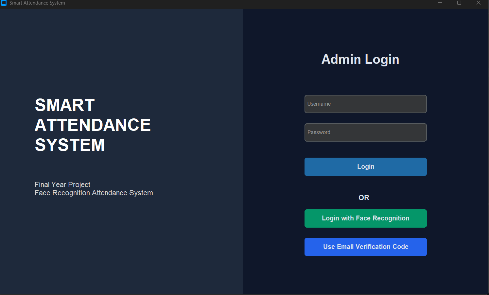
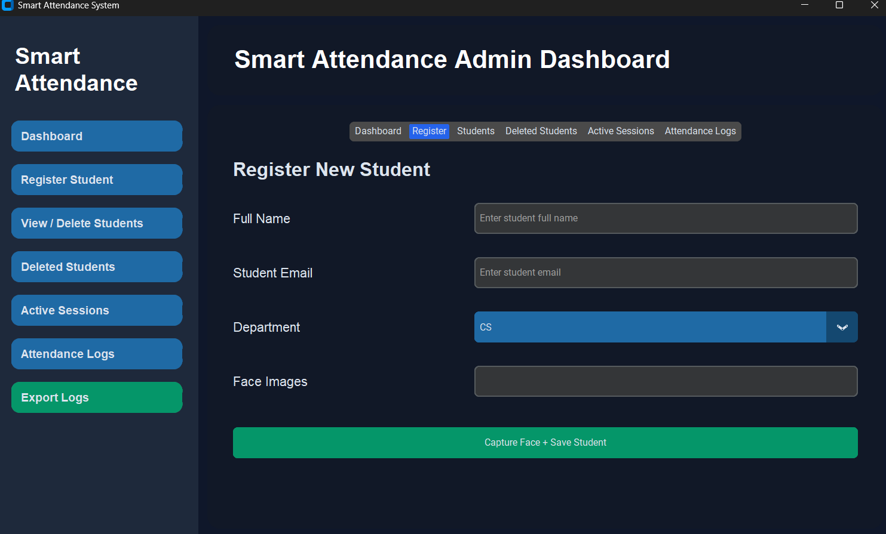
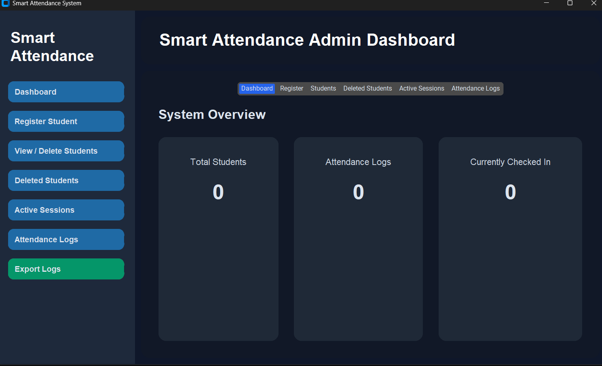

# Smart Attendance System

An intelligent attendance management solution that automates student attendance using facial recognition technology.

## Overview

This project was developed to replace traditional manual attendance methods with an automated biometric-based system.

The application identifies registered students through facial recognition and records attendance data securely in a database.

## Key Features

- Face Recognition Authentication
- Student Registration
- Automated Check-In
- Automated Check-Out
- Attendance Duration Tracking
- Admin Dashboard
- Attendance Logs Management
- SQLite Database Integration
- Email Verification Fallback
- Anti-Spoofing Protection
- User-Friendly Interface

# Screenshots

## Welcome Page

The main entry point of the application where administrators can log in and students can access the attendance system.

## Student Registration

Allows administrators to register students and capture facial data for recognition.

## Admin Dashboard

Provides attendance monitoring, student management, and system administration tools.

