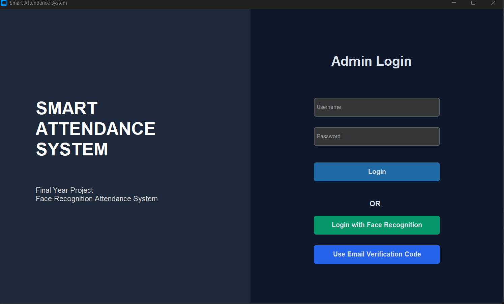
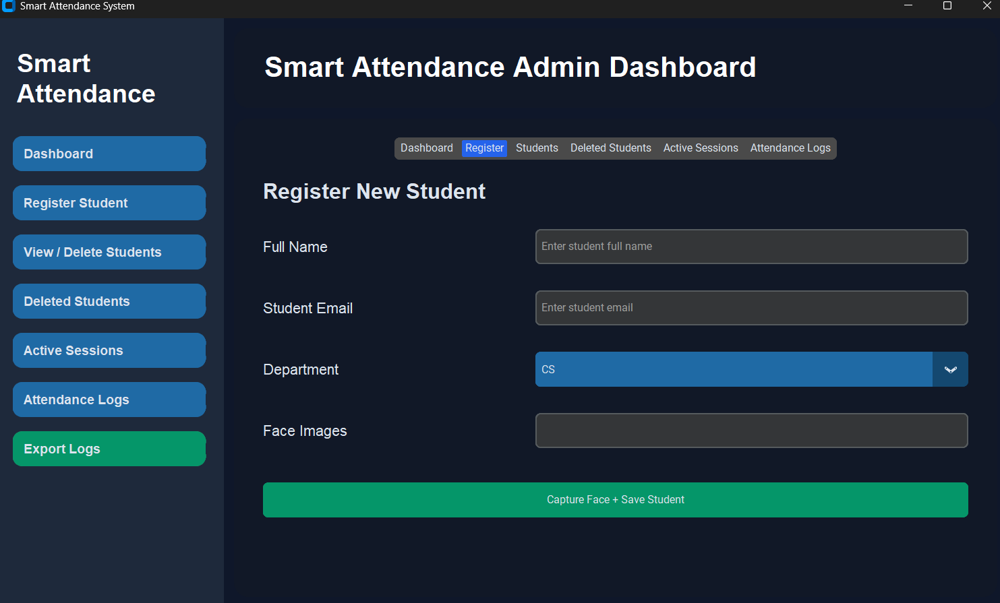
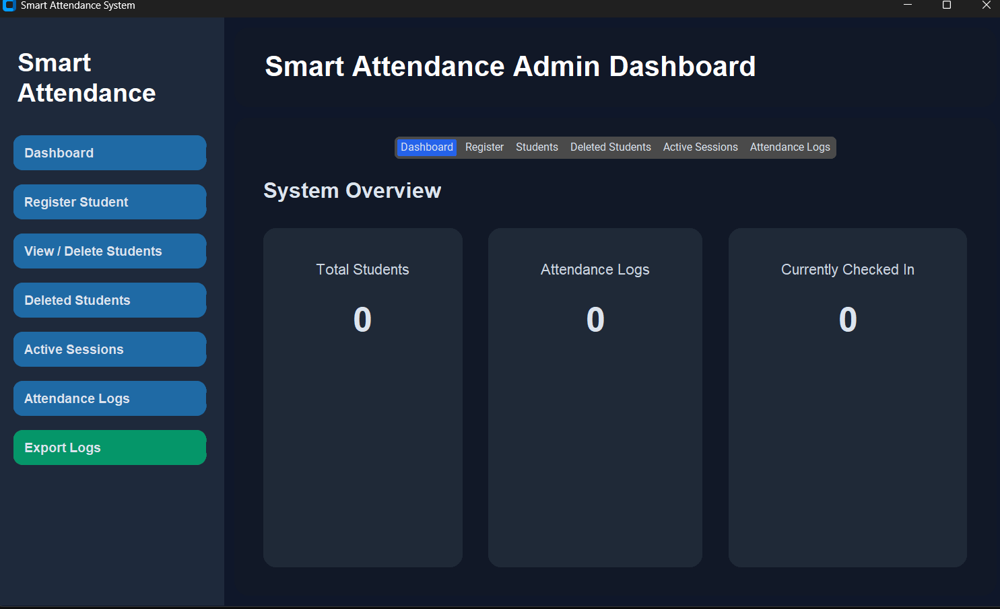

# Smart Attendance System

A desktop application that records student attendance with face recognition. Students check in by looking at the camera, the app confirms they are a live person by asking them to blink, and every check-in, check-out and hour spent is stored in a local database that administrators manage from a dashboard.

Built in Python with OpenCV, CustomTkinter and SQLite as a final-year project.



## Features

**For students**
- Face login: the camera recognizes the student and checks them in automatically.
- Blink liveness check: the student must blink before login is accepted, which blocks simple photo attacks.
- Email code login: if the camera fails or the face is not recognized, the student receives a 6-digit code by email, valid for 5 minutes.
- Student portal: profile, a live timer for the current session, a Check Out button, total hours and full attendance history.

**For administrators**
- Dashboard with student and attendance counts.
- Student registration: enter name, email and department, then capture 20 face images. The face model retrains automatically.
- Student management: view and delete students. Deleted students move to an archive, and their attendance history is kept.
- Active sessions: see who is checked in right now and check a student out manually.
- Attendance logs: every check-in and check-out with time and duration, filterable by student and exportable to CSV.

## How it works

1. **Face detection** finds faces in the camera frame with OpenCV Haar cascades.
2. **Liveness** tracks the eyes and requires an open, closed, open sequence (a blink) with head-movement and glare checks.
3. **Face recognition** compares the face to the trained LBPH model (`trainer.yml`). Login is accepted only when the same student is matched with enough confidence for 5 frames in a row.
4. **Attendance** opens a session in the SQLite database (`attendance.db`) at check-in and closes it at check-out with the total time.

## Tech stack

| Area | Tools |
|---|---|
| Language | Python 3.11 |
| Interface | CustomTkinter |
| Computer vision | OpenCV (Haar cascades, LBPH face recognizer), NumPy, Pillow |
| Database | SQLite3 |
| Email codes | smtplib with Gmail SMTP, settings loaded from `.env` with python-dotenv |

## Project structure

```
Smart-Attendance-System/
├── Welcome.py        # Entry point: admin login, face login, email code login
├── Main.py           # Admin dashboard
├── User.py           # Student portal
├── Functions.py      # Camera, liveness, face login, email codes, student registration
├── Train.py          # Trains the face recognition model from dataset/
├── database.py       # All SQLite tables and queries
├── requirements.txt  # Python packages
├── .env.example      # Template for your email settings
└── screenshots/      # Images used in this README
```

Created when you run the app (kept out of Git because they hold personal data):
`attendance.db`, `dataset/` (face images), `trainer.yml` (trained model), exported `.csv` logs.

## Getting started

### Requirements
- Python 3.11 or newer
- A webcam
- A Gmail account with 2-Step Verification turned on (for the email code login)

### Installation

```bash
git clone https://github.com/julienelhaber/Smart-Attendance-System.git
cd Smart-Attendance-System
python3 -m venv .venv
source .venv/bin/activate        # Windows: .venv\Scripts\activate
pip install -r requirements.txt
```

OpenCV is pinned to version 4.x on purpose: the OpenCV 5 packages do not include the Haar cascade files this app needs for face and eye detection.

### Email settings

1. Create a Gmail [app password](https://support.google.com/accounts/answer/185833).
2. Copy `.env.example` to a new file named `.env`.
3. Put your Gmail address and the app password in `.env`.

`.env` stays on your computer and is never uploaded.

### Run

```bash
python Welcome.py
```

The administrator login is currently set in `Welcome.py`. Change it before using the app with real students.

## Screenshots

**Student registration**



**Admin dashboard**



## Privacy

Face images, the trained model and the attendance database contain personal data. They are stored only on the computer running the app and are excluded from the repository by `.gitignore`. Get consent from students before registering their faces.

## Roadmap

- Store administrator accounts in the database with hashed passwords
- Prevent duplicate student emails
- Add logging and automated tests
- Run the camera in a background thread so the interface never freezes
- Stronger anti-spoofing (random challenges or a deep-learning liveness model)
- Deep-learning face embeddings instead of LBPH for higher accuracy
- Attendance reports and charts per day and per department

## Author

Julien El Haber ([@julienelhaber](https://github.com/julienelhaber))
